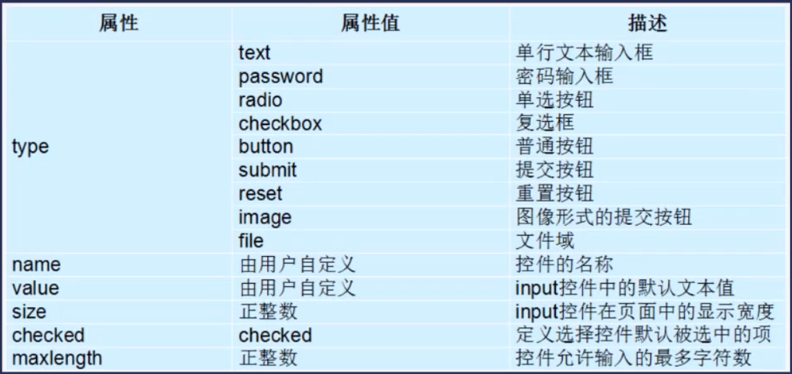

## HTML 表单标签

### 概念

1. 在网页中, 有些业务需要跟用户进行交互, 收集用户资料, 此时就要用到表单
2. 在 HTML 中, 一个完整的表单通常由表单元素, 提示信息, 表单域 3 个部分构成


### 表单域

1. 在 HTML 中, **form** 标签被用于定义表单域, 相当于一个容器, 用来容纳所有的表单控件和提示信息

   ```html
   <form action="url地址" method="http提交方式" name="表单名称">
       各种表单控件, 提示信息
   </form>
   ```

2. 表单控件: 
   + 单行文本输入框
   + 密码输入框
   + 复选框
   + 提交按钮
   + 重置按钮


### input 标签

1. input 标签为单标签, type 属性为最基本的属性, 取值有很多种, 用于指定不同的控件类型, 如下图所示:

2. 单选框示例:

   ```html
   <input type="radio" name="sex" value="1" checked>男
   <input type="radio" name="sex" value="0">女
   ```

3. 复选框示例:

   ```html
   <input type="checkbox" name="hobby" value="1" checked>羽毛球
   <input type="checkbox" name="hobby" value="2">篮球
   <input type="checkbox" name="hobby" value="3">足球
   ```

4. 文件上传

   ```html
   <input type="file">
   ```

5. 点击按钮

   ```html
   <input type="button" value="注册按钮">
   <input type="submit" value="提交按钮">
   <input type="reset" value="重置按钮">
   ```

 

### label 标签

1. 用于绑定一个表单元素, 当点击 label 标签的时候, 被绑定的表单元素就会获取**输入焦点**

   ```html
   <label for="password">
       用户名: <input type="text"><br/>
       密码: <input type="password" id="password"><br/>
   </label>
   ```

   当用户点击 label 标签中的元素时, 密码输入框将获得输入焦点

2. 在 IDE 里边写代码时, 用户输入标签(input, textarea)必须和 label 标签一起使用, 不然会有警告


### textarea 标签

1. 文本内容, 用于写评论等

   ```html
   <label>
       输入评论:
       <textarea cols="每行中的字符数" rows="显示的行数"></textarea>
   </label>
   ```


### 下拉菜单

```html
城市
<select>
    <option value="1">武汉</option>
    <option value="2">北京</option>
    <option value="3" selected>上海</option>
    <option value="4">深圳"</option>
</select>
```


