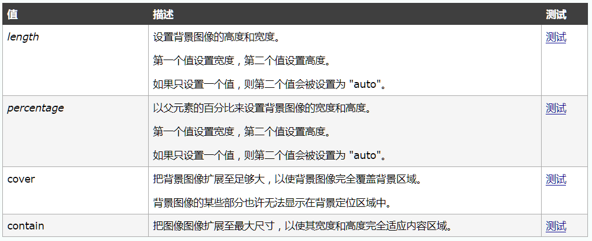

## 设置背景

### background-color

### background-image

1. 设置背景图片

   需要一个url地址作为参数

2. 例子：background-image:url(图片的路径)

3. 使用注意

   + 如果背景图片大于元素，默认会显示图片的左上角
   + 如果背景图片和元素一样大，则会将背景图片全部显示
   + 如果背景图片小于元素大小，则会默认将背景图片平铺以充满元素
   + 可以同时为一个元素指定背景颜色和背景图片，这样背景颜色将会作为背景图片的底色, 一般情况下设置背景图片时都会同时指定一个背景颜色

### background-repeat

1. 设置背景图片重复方式

| 值        | 描述                                               |
| --------- | -------------------------------------------------- |
| repeat    | 默认值，背景图片会平铺显示	沿x轴和y轴双方向重复 |
| no-repeat | 背景图片不重复                                     |
| repeat-x  | 背景图片沿水平方向重复                             |
| repeat-y  | 背景图片沿垂直方向重复                             |

### background-positon

1. 设置背景图片的位置

   + 设置方式一

     可以直接通过几个位置的关键字来设置图片的位置

     + top, left, right, bottom, center
     + 可以通过以上关键字两两组合的形式，将背景图片设置到元素的任意位置
     + 如果仅仅指定一个值，则第二个值默认是center

   + 设置方式二
     可以直接指定两个值，来设置背景图片的偏移量

     例子：background-position : x轴偏移量  y轴偏移量;

     + x轴偏移量，用来指定图片的水平位置

       如果指定一个正值，则图片向右移动

       如果指定一个负值，则图片向左移动

     + y轴偏移量，用来指定图片的垂直位置

       如果指定一个正值，则图片向下移动

       如果指定一个负值，则图片向上移动

### background-size

1. 规定背景图像的尺寸

2. 使用方式

   background-size: length|percentage|cover|contain;

3. 常用 (cover, contain)

   cover: 足够大

   contain: 微博中的图片留白

### background-attachment

1. 用来设置背景是否随页面滚动

   + scroll

     默认值，背景图片会随页面一起滚动

   + fixed

     背景图片不随页面滚动，会固定在页面的指定位置

     设置该属性的背景，则背景会永远相对于浏览器窗口进行定位

     一般这种背景都会设置给body

### background

1. 背景的简写属性
2. 可以通过它来设置所有的背景相关的样式
3. 该简写属性没有顺序的要求，也没有数量的要求，不写的属性使用默认值 

例子: background: url() no-repeat center center fixed

参数依次是: background-image    background-repeat    background-positon   background-attachment 

### opacity

1. 用来设置背景的不透明度

   可选值

   0-1

   0表示完全透明

   1表示完全不透明

   0.5半透明

   

2. IE8及以下的浏览器不支持该样式，可以使用滤镜来代替

   filter:alpha(opacity=值)

   这里值需要一个0-100之间的值

   0相当于完全透明

   100完全不透明

