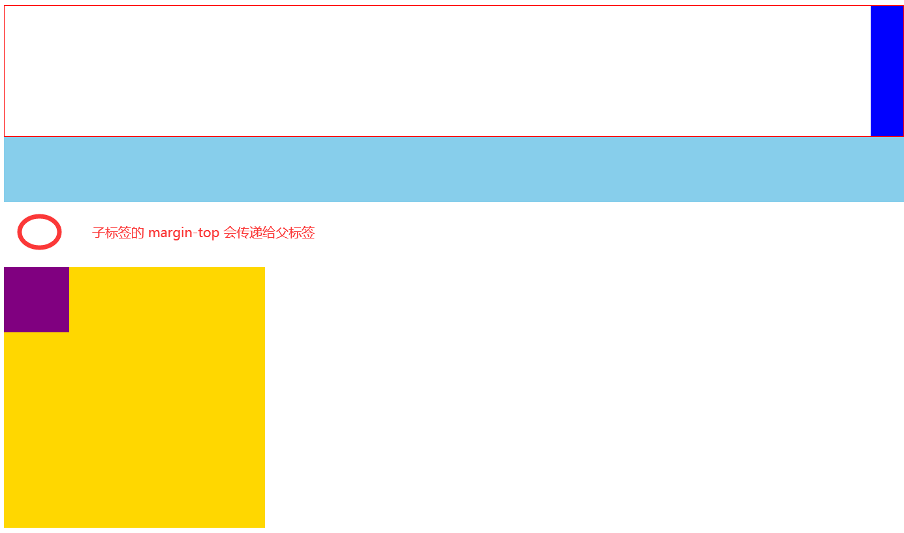

## 高度塌陷完善

### 针对现象

子元素和父元素相邻的垂直外边距 (x 轴的外边距,  y轴的不会重叠) 会发生重叠, 子元素的外边距会传递给父元素

### 图示




### 解决方法

1. 使用空的 table 标签可以隔离父子元素的外边距, 阻止外边距的重叠

   ```html
   <div class="box04">
       <table></table>
       <div class="box05"></div>
   </div>
   ```


### 最终解决方案

经过修改后的 clearfix 是一个多功能的, 既可以解决高度塌陷, 又可以确保父元素和子元素的垂直外边距不会重叠  (群组选择器)

```css
.clearfix:before,
.clearfix:after {
    content: "";  /*填充内容 默认 "" */
    display: table;  /*标签类型*/
    clear: both;
}
```


