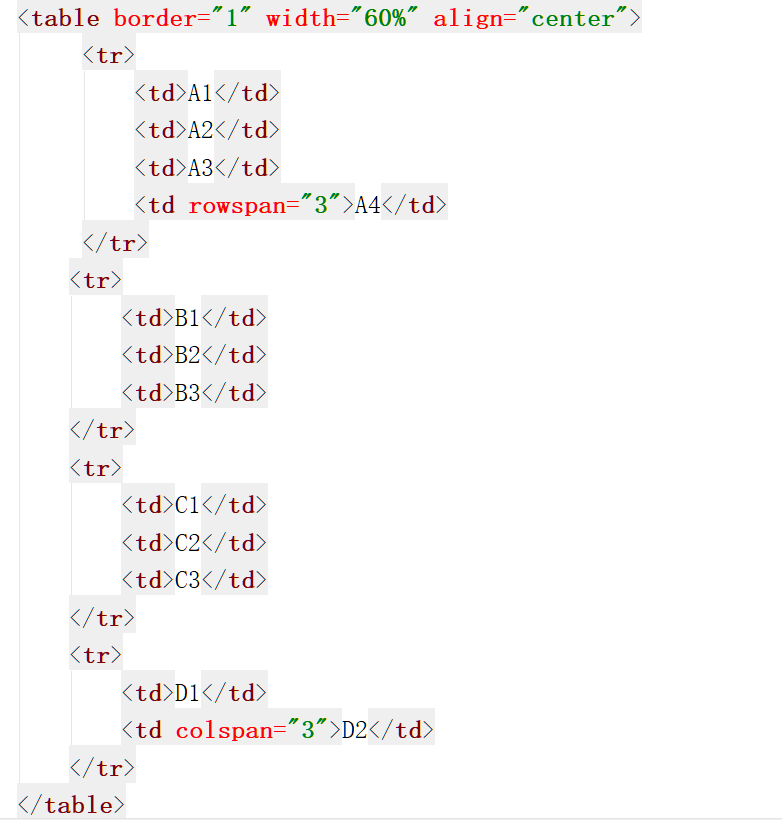

## 表格标签

### 基本概念

1. 表格在日常生活中使用的非常的多, 比如: excel就是专门用来创建表格的工具, 表格就是用来表示一些格式化的数据的, 比如：课程表, 工资表,  在网页中也可以来创建出不同的表格来表示不同内容.

### 使用

1. 在HTML中, 使用 table 标签来创建一个表格
2. 在table标签中使用 tr 来表示表格中的一行, 有几行就有几个 tr
3. 在 tr 中需要使用 th 来创建一个标题单元格, 有几个单元格就有几个 th
4. 在 tr 中需要使用 td 来创建一个内容单元格, 有几个单元格就有几个 td
5. rowspan 用来设置纵向的合并单元格
6. colspan 用来设置横向的合并单元格

### 基本操作

### 长表格

1. 使用场景: 有一些情况下表格是非常的长的, 这时就需要将表格分为三个部分, 表头, 表格的主体, 表格底部

2. 三个标签

   + thead 表头

     thead中的内容, 永远会显示在表格的头部

     tbody 表格主体, tbody中的内容, 永远都会显示表格的中间

     tfoot 表格底部, tfoot中的内容, 永远都会显示表格的底部

3. 如果表格中没有写 tbody, 浏览器会自动在表格中添加tbody, 并且将所有的 tr 都放到 tbody 中

